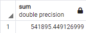
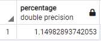
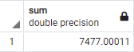
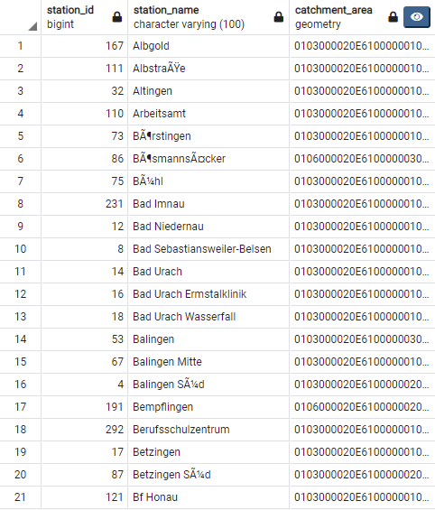
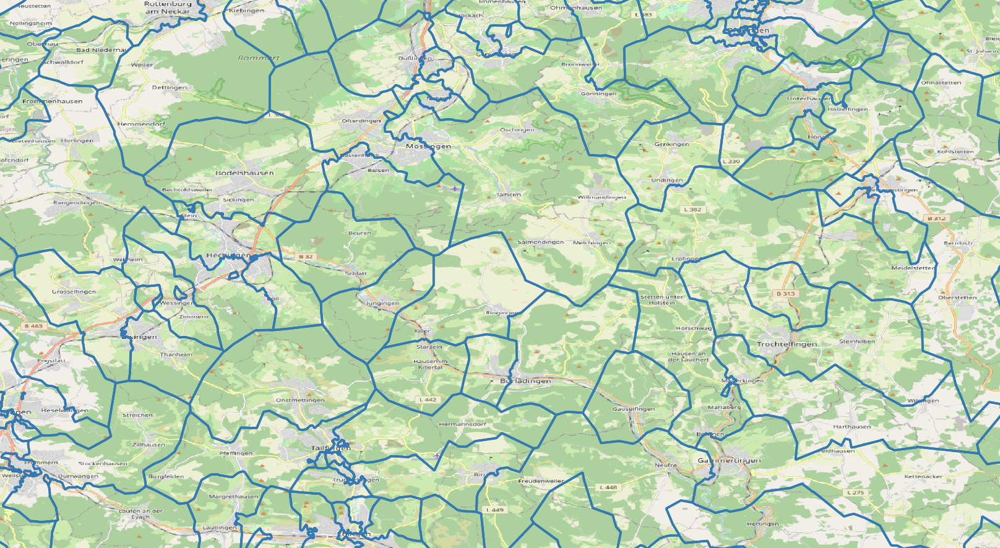
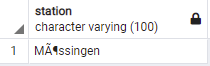
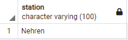
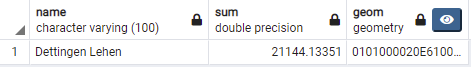
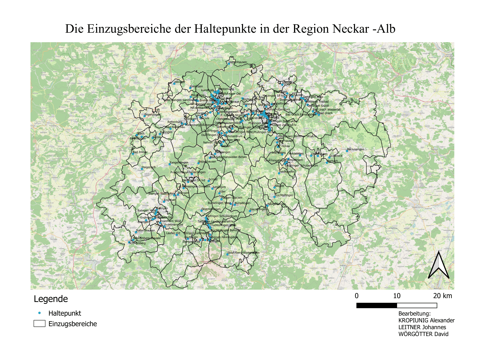

# Spatial Databases - Presentation

## Capability analysis of planned commuter railway system “Neckar-Alb”

### 1. Project Description

In this project we will show the benefits of the commuter railway system that is going to be established in the region 
"Neckar-Alb". Examples of measures we want to compute are "How fast can central towns be reached?", "Which 
infrastructure within the catchment areas of the stations get better accessibility?", or "How many people can reach
their nearest station withing 5 (10, 15, ...) minutes?". More information about the railway system can be found 
[here](https://www.regionalstadtbahn.de).

Our project contains the following spatial components: locations of stations, analyzed catchment areas, tiles with
population information, boundaries of municipalities and the region itself, the street network and the crossings 
as vertices.

In the following sections we describe how we processed the data for our model and present some example queries.
Then we give a brief outlook of our next steps.

### 2. Available Datasets

We start with the following shapefiles provided by the ‘Regionalverband Neckar-Alb’:

- the train stations of Baden-Württemberg (existing ones plus planned ones for regional tramway Neckar-Alb).
- a raster of Baden-Württemberg, each tile owning an information about the number of inhabitants living within this tile.
- the communities of Baden-Württemberg

In order to get any information about the street network of our examined region, we use the datasets being available at the Geofabrik download server (download.geofabrik.de/europe/germany/baden-wuerttemberg.html), where we download tuebingen-regbez-latest.osm.pbf to get the street network of our administrative district.

In addition, we downloaded the program [osm2po](https://www.osm2po.de) to convert tuebingen-regbez-latest.osm.pbf for postgis usage. We decided for version 5.0.0, as it is known that there are some bugs in the newer versions of osm2po.

After we ran the program osm2po over tuebingen-regbez-latest.osm.pbf, we receive a SQL-dataset. The instructions of this dataset were copied into the query tool of PgAdmin and executed. We now receive a SQL table called moessingen_2po_4pgr, which consists of the regional street network and already includes a cost column, which can be interpreted as the time cost (in hours) of traversing a single street segment by individual motor car traffic. 

The available shapefiles are uploaded to PgAdmin too. The SRID necessary to upload them is 4326. Because the shapefiles are originally using another SRID, they have to be reprojected before the upload. The Postgis GUI is actually used for the uploading process. Their table names are gitter_region_srid_4326, haltepunkte_srid_4326 and gemeinden_srid_4326.

### 3. Proceedings in PgAdmin

At first, we try to create a topology of this street network. For unknown reasons this is only possible when we delete the columns of source and target once and then reintroduce them. The following SQL query has been used:

~~~~sql
ALTER TABLE moessingen_2po_4pgr DROP COLUMN source;
ALTER TABLE moessingen_2po_4pgr DROP COLUMN target;
ALTER TABLE moessingen_2po_4pgr ADD COLUMN source INTEGER;
ALTER TABLE moessingen_2po_4pgr ADD COLUMN target INTEGER;
select pgr_createTopology('moessingen_2po_4pgr', 0, 'geom_way', 'id');
~~~~

When we want to determine the catchment area of one specific station, we have to define a point at a street next to this station, which can be used as source and target point in the following routing algorithms. There might be the case, that a station can be entered from more than one side and that there are many possible points as starting point. For the sake of simplicity, we decide for the nearest crossing point of each station. The SQL query is the following: 

~~~~sql
ALTER TABLE haltepunkte_srid_4326 ADD COLUMN nearest_node INTEGER;
update haltepunkte_srid_4326 as b set nearest_node = (
Select a.id from moessingen_2po_4pgr_vertices_pgr as a order by a.the_geom <-> b.geom limit 1);
~~~~

Now we have connected the stations with the crossing points. Some stations are outside of the administrative district, which is covered by the street network. Those stations shall not be taken into consideration of course. The distance must be computed in order to delete those unnecessary train stations.

~~~~sql
ALTER TABLE haltepunkte_srid_4326 ADD COLUMN distance Real;
UPDATE haltepunkte_srid_4326 AS a SET distance=
(SELECT ST_Distance(a.geom, 
(SELECT the_geom FROM moessingen_2po_4pgr_vertices_pgr WHERE moessingen_2po_4pgr_vertices_pgr.id=a.nearest_node)));
DELETE FROM haltepunkte_srid_4326 WHERE distance > 0.0064;
~~~~

A threshold value (0.0064) was found, so that each station with a higher distance to a node gets deleted. 

In our nodes/vertices table, we must add a cost column as well, in order to save the time (in hours) needed for reaching this vertex from the nearest station. By default, this value is set to 10 hours. There will not be any vertices that are reached in more than 10 hours Whenever we find a connection between a station and a vertex, we proof the cost value and in case we found a lower cost value do the updating procedure. 

~~~~sql
ALTER TABLE moessingen_2po_4pgr_vertices_pgr ADD COLUMN cost REAL;
UPDATE moessingen_2po_4pgr_vertices_pgr SET cost = 10;
~~~~

Now we can do the routing analysis for a selected station as starting activity:

~~~~sql
UPDATE moessingen_2po_4pgr_vertices_pgr SET cost = (
SELECT cost FROM pgr_drivingDistance(
'SELECT id, source, target, cost FROM moessingen_2po_4pgr',
60167,
0.5,
false,
false) WHERE id1=moessingen_2po_4pgr_vertices_pgr.id);
UPDATE moessingen_2po_4pgr_vertices_pgr SET cost = 10 WHERE cost IS NULL;
~~~~
Of course, the costs must be set to 10 hours again afterwards because if there would be NULL-values, we could not do any comparisons any more. We decide for looking what vertices can be reached in half an hour, as we are convinced, that the nearest station is reached within 30 minutes from every point in our region of interest. 

As we must keep knowledge about the station name and its ID, we add two columns to the nodes/vertices table. This is done like:

~~~~sql
ALTER TABLE moessingen_2po_4pgr_vertices_pgr ADD COLUMN station VARCHAR(100);
ALTER TABLE moessingen_2po_4pgr_vertices_pgr ADD COLUMN station_id INTEGER;
~~~~

We do not want that each station comes into play separately. Instead, all stations shall be worked through nonstop. Therefore, an extensive function was written:

~~~~sql
CREATE OR REPLACE FUNCTION hello_world( ) RETURNS void AS
$$
DECLARE
used_node record;
BEGIN
FOR used_node IN SELECT nearest_node, name FROM haltepunkte_srid_4326 LOOP 
	RAISE NOTICE '%',used_node.nearest_node;
CREATE TABLE tempo (id bigint, cost real); 
INSERT INTO tempo SELECT id, cost FROM moessingen_2po_4pgr_vertices_pgr;
UPDATE tempo SET cost = (
SELECT cost FROM pgr_drivingDistance(
'SELECT id, source, target, cost FROM moessingen_2po_4pgr',
used_node.nearest_node,
0.5,
false,
false) WHERE id1=tempo.id);
UPDATE tempo SET cost = 10 WHERE cost IS NULL;
UPDATE moessingen_2po_4pgr_vertices_pgr SET cost= LEAST (cost,
(
SELECT cost FROM tempo WHERE (tempo.id = moessingen_2po_4pgr_vertices_pgr.id)
)),
station = used_node.name WHERE (cost > (SELECT cost FROM tempo WHERE (tempo.id = moessingen_2po_4pgr_vertices_pgr.id)));
RAISE NOTICE 'Moessingen updated%',used_node.nearest_node;
DROP TABLE IF EXISTS tempo;
END LOOP;
END;
$$ LANGUAGE plpgsql;
~~~~

The basic idea behind this function is to create a temporary table called tempo, which is actually a copy of our nodes/vertices table. The station, whose turn it is, is examined and the cost values are updated in the temporary table tempo. The table tempo only maps the cost values of the station, whose turn it is. In case, at some vertices there are lower cost values than in the other table, this other table gets updated.  

Executing this function needs several days as computation costs!

~~~~sql
SELECT hello_world();
~~~~

Right now, only the station name is inserted in the nodes/vertices table. The station ID gets handed in later by the following SQL statement:

~~~~sql
UPDATE moessingen_2po_4pgr_vertices_pgr SET station_id = (SELECT gid FROM haltepunkte_srid_4326 WHERE haltepunkte_srid_4326.name=moessingen_2po_4pgr_vertices_pgr.station ORDER BY gid LIMIT 1);
~~~~

Lastly, we want to connect the population values of our population raster with the vertices, so that one can analyze for example how many people life within the catchment area of a chosen station. The following idea is followed: If several vertices are inside of one raster tile, the amount of people living at that tile is split up to the included tiles. In case a single raster tile is free of vertices, all inhabitants of the tile are allocated to the nearest vertex outside the tile. As the connection between tiles and vertices is a many-to-may-relation, a new table nodes_tiles is introduced. But before that, we have to transform the inhabitant number from integer values to real values, so that divisions can be performed. 

~~~~sql
ALTER TABLE gitter_region_srid_4326 ADD COLUMN einwohner_real real;
UPDATE gitter_region_srid_4326 SET einwohner_real = einwohner;
~~~~

Now we are ready to design our table nodes_tiles. At the start, we import the IDs of the vertices and tiles in case of an intersection. Empty tiles without vertices are not taken into consideration.

~~~~sql
CREATE table nodes_tiles AS
SELECT moessingen_2po_4pgr_vertices_pgr.id, gitter_region_srid_4326.gid
FROM moessingen_2po_4pgr_vertices_pgr
JOIN gitter_region_srid_4326
ON ST_Intersects(moessingen_2po_4pgr_vertices_pgr.the_geom, gitter_region_srid_4326.geom);
~~~~

Naturally, there must be an information about the population as well:

~~~~sql
ALTER TABLE nodes_tiles ADD COLUMN einwohner real;
~~~~

Afterwards we introduce the corresponding population values. In case there are some vertices within a tile, the population is split up in equal parts.

~~~~sql
UPDATE nodes_tiles SET einwohner = ((SELECT einwohner FROM gitter_region_srid_4326 WHERE gitter_region_srid_4326.gid = nodes_tiles.gid)/(SELECT anzahl FROM
(									
SELECT
 	gitter_region_srid_4326.gid AS gid2,
 	COUNT(moessingen_2po_4pgr_vertices_pgr.id) AS anzahl
FROM moessingen_2po_4pgr_vertices_pgr
JOIN gitter_region_srid_4326 
ON ST_Intersects(moessingen_2po_4pgr_vertices_pgr.the_geom, gitter_region_srid_4326.geom) 
GROUP BY gitter_region_srid_4326.gid
) AS a
WHERE nodes_tiles.gid=a.gid2));
~~~~

The relations between tiles and vertices not intersecting each other is still missing. But as we cannot ignore the tiles not including any vertices, we have to solve this task using detour with the use of a helping table. This table shall include the IDs and population values of all missing tiles and IDs of the nearest vertices to them. The following SQL query delivers this helping table:

~~~~sql
CREATE TABLE hilfstabelle AS						
Select a.gid, a.einwohner_real,(SELECT id FROM moessingen_2po_4pgr_vertices_pgr AS b order by a.geom <-> b.the_geom limit 1) from gitter_region_srid_4326 as a
WHERE ST_Disjoint(a.geom, (SELECT the_geom FROM moessingen_2po_4pgr_vertices_pgr AS c order by c.the_geom <-> a.geom limit 1));
~~~~

Finally, the values of our helping table are added at the table nodes_tiles making use of a function:

~~~~sql
CREATE OR REPLACE FUNCTION update_nodes_tiles( ) RETURNS void AS
$$
DECLARE
used_one record;
BEGIN
FOR used_one IN SELECT id,einwohner_real,gid FROM hilfstabelle LOOP
INSERT INTO nodes_tiles VALUES (used_one.id, used_one.gid, used_one.einwohner_real);
END LOOP;
END;
$$ LANGUAGE plpgsql;

SELECT update_nodes_tiles( );
~~~~

The data structure demanded for specialized queries is established, so we can continue with exciting queries.

### 4. Queries

### How many people reach their neares station in less than 5 minutes?
~~~~sql
SELECT SUM(nodes_tiles.einwohner)
FROM moessingen_2po_4pgr_vertices_pgr
JOIN nodes_tiles ON moessingen_2po_4pgr_vertices_pgr.id=nodes_tiles.id
WHERE moessingen_2po_4pgr_vertices_pgr.cost < 0.08333333;
~~~~

### What percentage of resitents do not reach their neares station in 15 minutes?
~~~~sql
SELECT (
	SELECT SUM(nodes_tiles.einwohner)
	FROM moessingen_2po_4pgr_vertices_pgr
	JOIN nodes_tiles ON moessingen_2po_4pgr_vertices_pgr.id=nodes_tiles.id
	WHERE moessingen_2po_4pgr_vertices_pgr.cost > 0.25
) / (
	SELECT SUM(einwohner)
	FROM nodes_tiles
) * 100 AS percentage;
~~~~

### How many people live within the catchment area of the station 'Bodenhausen'?
### How many pople have 'Bodenhausen' as their closest station?
~~~~sql
SELECT SUM(nodes_tiles.einwohner)
FROM moessingen_2po_4pgr_vertices_pgr 
JOIN nodes_tiles ON moessingen_2po_4pgr_vertices_pgr.id=nodes_tiles.id
WHERE moessingen_2po_4pgr_vertices_pgr.station = 'Bodelshausen';
~~~~

### Create table that contains the polygons of a voronoi partitioning of all nodes
~~~~sql
CREATE TABLE IF NOT EXISTS nodes_voronoi (
   node_id integer NOT NULL,
   geom geometry(POLYGON,4326) NOT NULL,
   PRIMARY KEY (node_id),
   FOREIGN KEY (node_id)
      REFERENCES moessingen_2po_4pgr_vertices_pgr (gid)
);
INSERT INTO nodes_voronoi (
	SELECT nodes.gid AS node_id, voronoi.geom AS geom
	FROM moessingen_2po_4pgr_vertices_pgr AS nodes
	JOIN (
		SELECT (ST_Dump(ST_VoronoiPolygons(ST_Collect(geom)))).geom AS geom
		FROM moessingen_2po_4pgr_vertices_pgr
		WHERE station IS NOT NULL
	) AS voronoi ON ST_Contains(voronoi.geom, nodes.geom)
	WHERE nodes.station IS NOT NULL
);
~~~~

### What are the catchment areas of each station?
~~~~sql
SELECT nodes.station_id AS station_id, nodes.station AS station_name, ST_Union(nodes_voronoi.geom) AS catchment_area
FROM moessingen_2po_4pgr_vertices_pgr AS nodes
INNER JOIN nodes_voronoi ON nodes.gid=nodes_voronoi.node_id
GROUP BY nodes.station, nodes.station_id;
~~~~

### What station is closest to the 'Mühlgärtle' park in Mössingen (coordinates 9.059809°E, 48.407550°N)?
~~~~sql
SELECT station
FROM moessingen_2po_4pgr_vertices_pgr
ORDER BY ST_Distance(geom, ST_GeomFromText('POINT(9.059809 48.407550)', 4326)) ASC
LIMIT 1
~~~~

### What station is closest to the public swimming pool in Mössingen (coordinates 9.067938°E 48.413985°N)?
~~~~sql
SELECT station
FROM moessingen_2po_4pgr_vertices_pgr
ORDER BY ST_Distance(geom, ST_GeomFromText('POINT(9.067938 48.413985)', 4326)) ASC
LIMIT 1
~~~~

### Which station has the most people in its catchment area?
~~~~sql
SELECT haltepunkte_srid_4326.name, SUM(einwohner), haltepunkte_srid_4326.geom
FROM haltepunkte_srid_4326 
JOIN moessingen_2po_4pgr_vertices_pgr ON moessingen_2po_4pgr_vertices_pgr.station_id=haltepunkte_srid_4326.gid
JOIN nodes_tiles ON moessingen_2po_4pgr_vertices_pgr.id=nodes_tiles.id
GROUP BY haltepunkte_srid_4326.gid
ORDER BY "sum" DESC
LIMIT 1
~~~~

### 5. Further outlook

We produced a mockup map of the catchment area and we will in further iterations improve this map cartographically.

Perhaps we will create a second map, pointing out the time cost necessary to travel to the nearest train station.

For the final report we will also validate our current results and prove the constancy of the open street map data.

In addition we try to improve our database by defining primary and foreign keys and indices.
All tables should be in third normal form in the end.

Regarding the partitioning of work, Johannes came up with the initial project proposal and focused primarily on the 
preprocessing of data while Alexander and David did most of the queries. In total everyone did about a third of the
work.
